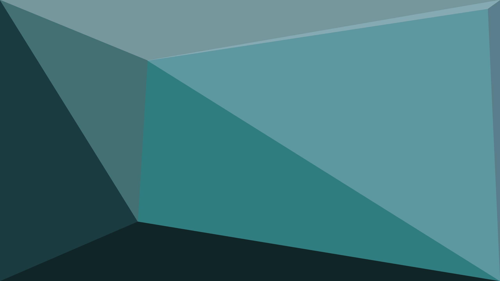
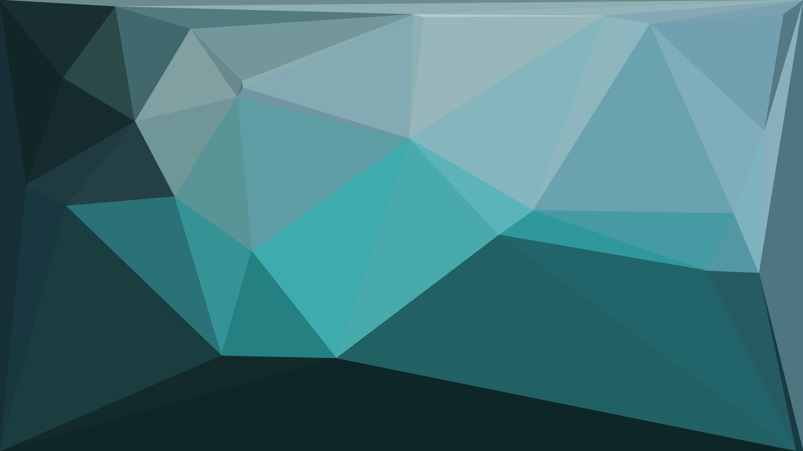
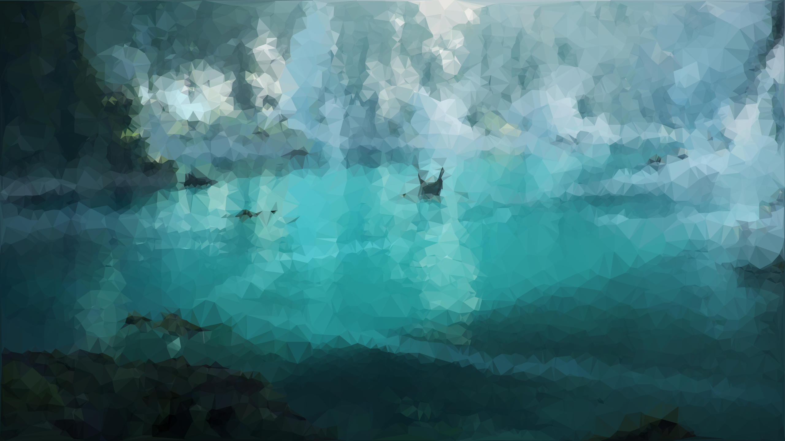
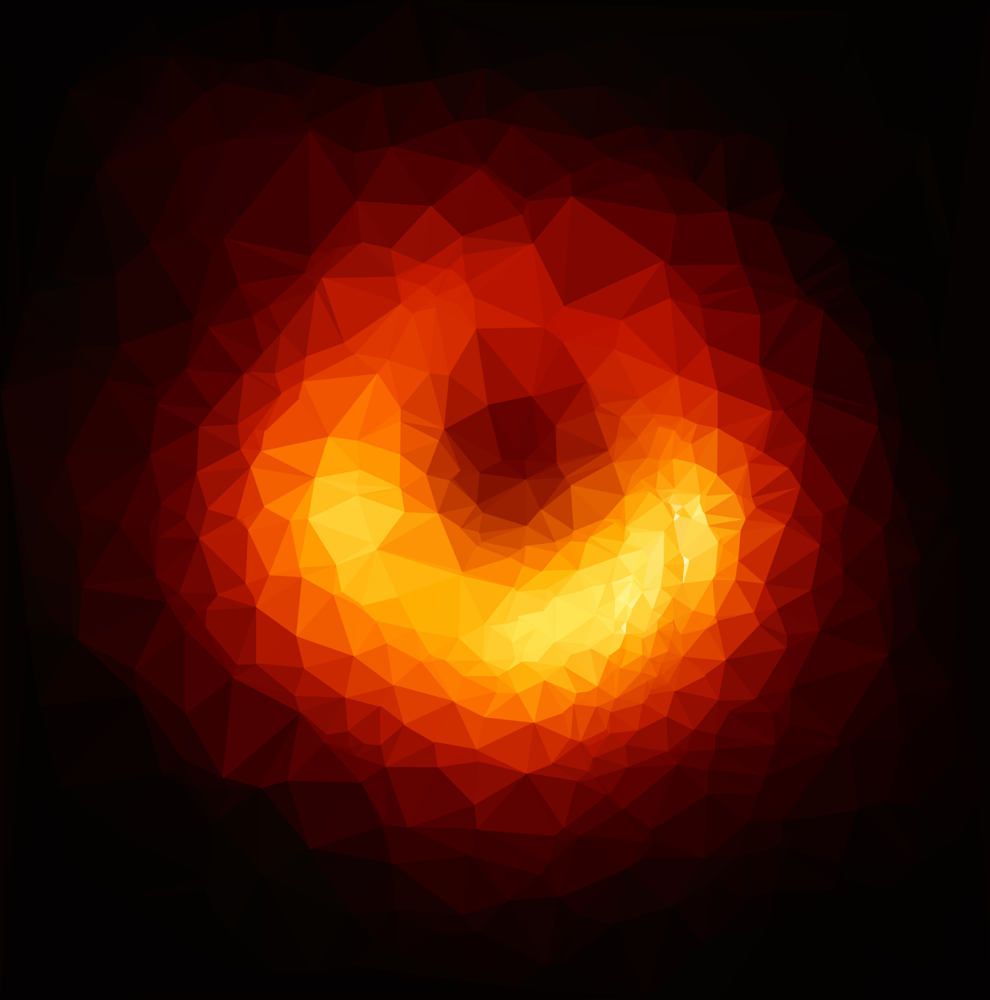
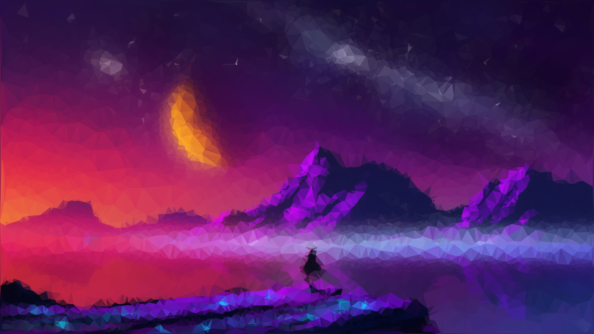
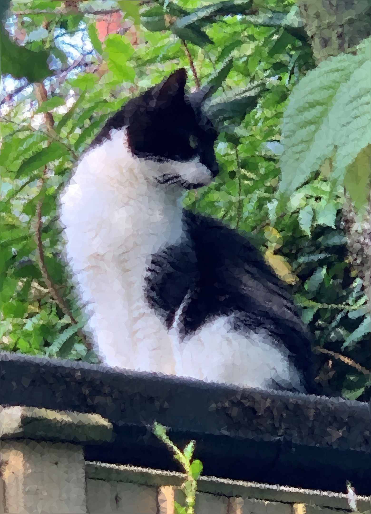
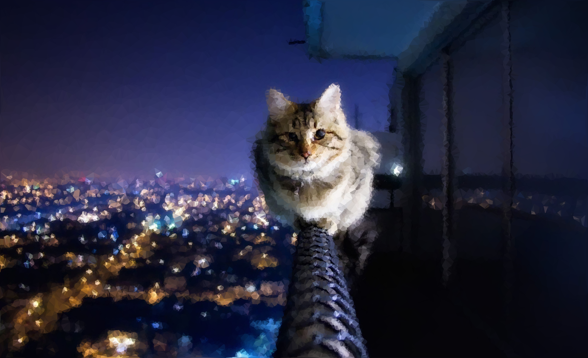

# Description

This is a program that converts images into low poly art. 

It reads an image in RGB format, calculating the intensity of colour using the \[0.213, 0.715, 0.072] vector. Dot multiplication is performed to return a 2D array, at which point two gaussian filters of varying standard deviations are ran over the array in order to blur with varying significance. The difference between these two images is used to identify the areas that stand out significantly from their surroundings, and a random sample is ran over this difference, wherein the areas that stand out are more likely to be selected. The standard deviations for the gaussian filters are manually provided. For a bigger difference between sigma values the algorithm will be more generous in identifying edges, and you may notice that polygons form less discriminatively. For a smaller difference edge detection is far more disciminatory, and in many cases the algorithm can fail to identify edges that are more complex.

The points selected in the random sample are ran through a Delaunay triangulation algorithm provided by scipy in order to construct a graph of triangles wherein the minimum angle is maximised, so as to avoid creating triangles that appear as slivers. This object is then used to calculate the average colour occurring within each polygon, and subsequently matplotlib.pyplot is used to plot everything. It can be then saved in any file format to the output folder within the current directory. One thing that I have noticed is that SVGs tend to display perfectly in the figure displayed by plt, but then plt saves them improperly so polygons no longer line up at corners properly. Currently I'd recommend you save images as PNGs, because lossy compression is perfect for images like this. 

You can choose to perform a rollout in which varying samples of the points generated are taken, using the function `int(3+x**2+0.02x**3)` over 100 steps. This is then used to generate a GIF (Note: The bit depth gets NUKED by being saved as a GIF). Alternatively, if you don't perform a rollout then you can choose the exact sensitivity. This has to be less than the number of returned samples. Considering there are 1 000 000 samples taken, the expectation of the number of samples returned is going to vary. If your image is very detailed you can expect to be able to take the sensitivity quite high without getting an ArgumentOutOfRange error, but if it's not then it'll be something like 100 000. In rollouts the highest value ends up being 29 209 which has worked fine for everything so far, and I wouldn't take it too much farther (maybe like 80 000). 

# Gallery

# Credit

This program is based on the program written by Samuel Hinton that can be found [here](https://cosmiccoding.com.au/tutorials/lowpoly). I've made a fair few changes to it, however I use their sampling method untouched (at least, as far as I remember I haven't made any changes to it).

The art used here is *Vast Universe* by [Michal Kváč](https://kvacm.artstation.com/) and *Discovery* by [Max Schiller](https://maxschillerdesign.com/). The image of the penguin is Featherknight from TFT by Riot Games. I couldn't find the artist responsible for the splash art, sorry ;-;.

The photo of the cat on the balcony is taken by [Ivo Berg](https://www.ivobergphotography.com/).

The red orb image is the second photo taken of the M87 black hole by [Event Horizon Telescope](https://eventhorizontelescope.org/blog/astronomers-image-magnetic-fields-edge-m87s-black-hole).

The image of an upside-down city is taken from the Spiderverse movie.

The other photos are my cat.
